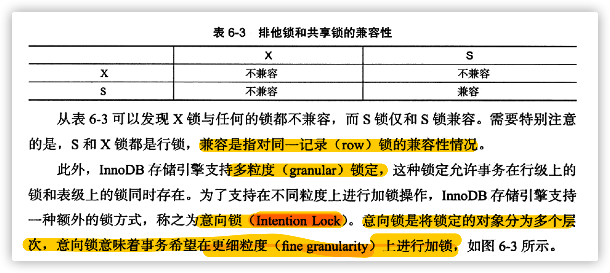
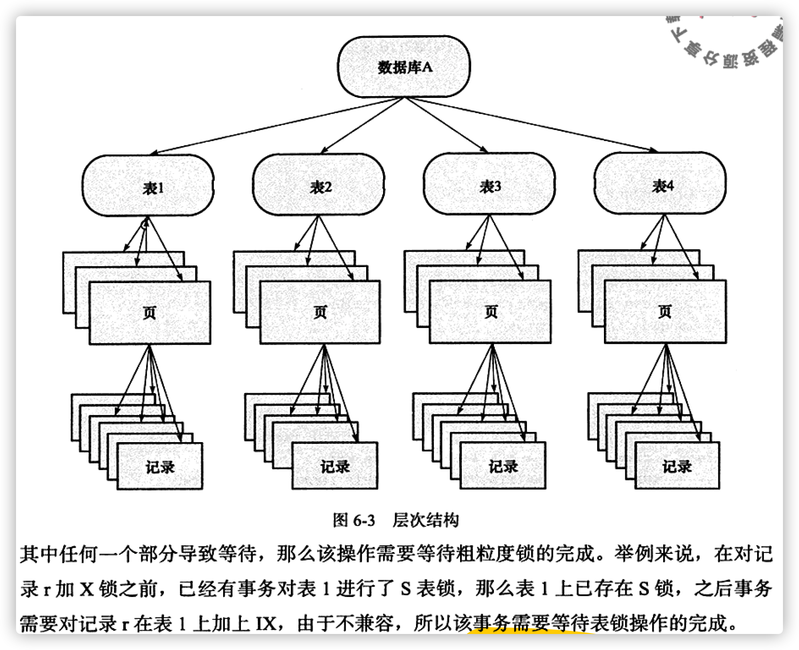
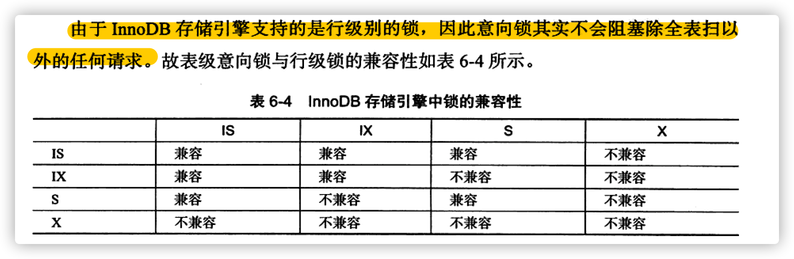

# 第 6 章 锁

## 6.3 InnoDB 存储引擎中的锁

InnoDB 存储引擎实现了两种标准的行级锁：

- 共享锁 （**S 锁**），允许事务读取一行数据
- 排它锁 （**X 锁**），允许事务更新或者删除一行数据

InnoDB 支持的意向锁比较简练，其意向锁为表级锁。设计的主要目的是为了在一个事务中揭示下一步将被请求的锁类型。它支持两种意向锁类型：

- 意向共享锁（**IS Lock**）：事务想要获得一张表中某几行的共享锁
- 意向排它锁（**IX Lock**）：事务想要获得一张表中某几行的排它锁

## 6.4 锁的算法

## 6.7 死锁

